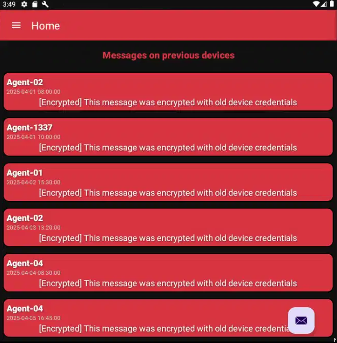

# Mission 5 DGSE x Root-Me (MOBILE)


On a une application de messagerie codée en Java, le code source a été analysé avec Jadx.

Le fichier **AndroidManifest.xml** nous permet d'identifier le package et les composants de l’application (fragments : Message, Invite, Profile, Home)

Les fichiers importants sont : 
- [HomeViewModel](images/decrypt.png) : charge les messages et les déchiffre grâce à la méthode `decryptMessages`.
    - Mécanisme de dérivation de la clé AES:

        - Obtention du modèle et de la marque de l’appareil via `Build.MODEL` et `Build.BRAND`.
        - Calcul d’un hash (SHA‑256 puis encodage Base64) de la chaîne `"MODEL:BRAND"`.
        - Dérivation de la clé AES en combinant ce hash avec un salt statique `"s3cr3t_s@lt"` et en appliquant SHA‑256.
- [RetrofitClient](images/url.png) : indique l'url de l'API [http://163.172.67.201:8000/], [ApiService](images/endpoint.png) l'endpoint `/messages` accessible via la méthode GET ainsi que le paramètre `id`.

Pour récupérer les messages, il nous faut donc d'abord obtenir la marque et le modèle de notre appareil (=émulateur Bluestacks). On peut pour cela utiliser **adb**:
```powershell
> .\adb.exe shell getprop ro.product.brand
samsung

> .\adb.exe shell getprop ro.product.model
SM-S908E
```

Script pour obtenir le device ID à partir de *brand* et *model*: 
```python
import hashlib
import base64

def hash_device_id(model, brand):
    device_id = f"{model}:{brand}"
    digest = hashlib.sha256(device_id.encode()).digest()
    return base64.b64encode(digest).decode()

model = "SM-S908E"
brand = "samsung"

print(hash_device_id(model, brand))
```

**Résultat :** `bSNMpCFc3a8TmeA78Mun3vRgb9D2S6pufNR/9rY6/a8=`

Pour récupérer les messages : 
```shell
curl "http://163.172.67.201:8000/messages?id=bSNMpCFc3a8TmeA78Mun3vRgb9D2S6pufNR/9rY6/a8="
```

**Résultat :**
```shell
{
    "messages": [
        {
            "content": "M2geCVKOzPlyug9p9DvthxPip0oe9BPiT2sDfFhWy7iC3+JQI4SfO7+SLAlFSUmu8LoGj1hrUWil/uNXvc+5mKBMrRNFQT8ijBK14P0Z8qA=",

            "isEncrypted": true,

 ...
```
On reçoit au total 9 messages, qu'on peut essayer de déchiffrer avec le script suivant : 

```python
import base64, hashlib
from Crypto.Cipher import AES

STATIC_IV = base64.b64decode("LJo+0sanl6E3cvCHCRwyIg==")
STATIC_SALT = "s3cr3t_s@lt"
model = "SM-S908E"
brand = "samsung"

messages = [...]          # 9 chaînes chiffrées - voir script solve

def hash_device_id(model, brand):
    device_id = f"{model}:{brand}"
    digest = hashlib.sha256(device_id.encode()).digest()
    return base64.b64encode(digest).decode()

def derive_key(device_id_hash, salt=STATIC_SALT):
    return hashlib.sha256(f"{device_id_hash}:{salt}".encode()).digest()

def decrypt_message(enc_b64, key):
    data = base64.b64decode(enc_b64)
    plain = AES.new(key, AES.MODE_CBC, STATIC_IV).decrypt(data)
    return plain[:-plain[-1]]

device_id_hash = hash_device_id(model, brand)
key = derive_key(device_id_hash)

for idx, enc in enumerate(messages, 1):
    try:
        txt = decrypt_message(enc, key).decode("utf-8")
        print(f"[Message {idx}] {txt}")
    except Exception:
        print(f"[Message {idx}] error")
```


Mais on se rend compte en testant de nombreux couples **model:brand**, que les 6 premiers messages restent chiffrés :



On comprend pourquoi en se rendant sur l'application et en relisant la consigne: `Lors d'une arrestation au domicile d'un des attaquants précédemment identifiés, l'équipe a saisi une vielle tablette Google utilisée pour leurs communications.`

On récupére [une liste](https://storage.googleapis.com/play_public/supported_devices.csv) d'appareils Android qui contient les anciens modèles de tablette Google (format csv pour le script - aperçu .html) :


On prend uniquement les valeurs de la 4ème colonne pour la marque Google et on tente le déchiffrement grâce à ce script **(solve)** :

```python
import csv, base64, hashlib, sys
from Crypto.Cipher import AES

STATIC_IV = base64.b64decode("LJo+0sanl6E3cvCHCRwyIg==")
STATIC_SALT = "s3cr3t_s@lt"
file = "supported_devices.csv"
brand = "Google"

messages = [
    "M2geCVKOzPlyug9p9DvthxPip0oe9BPiT2sDfFhWy7iC3+JQI4SfO7+SLAlFSUmu8LoGj1hrUWil/uNXvc+5mKBMrRNFQT8ijBK14P0Z8qA=",
    "//5PBsYWhHlgqhVgG1omUyevzmlErLZVsTCLO78Rbb9qBMPnsKCS5/RZ4GEdWRBPiZ4BtO5h7j2PuIutfqf7ag==",
    "2uNMSnJZa5JExhYgNA+V3RAiafhuLkj8Jnr4U+lSZOrrpMWjyA13w0Do3IIPcVBgK070rmweRKX/GkCAxat4i3JfWk1UvWNSmEZbHQlFznR7VFW6FKK84iJKhiDOp8Tk",
    "Swz/ycaTlv3JM9iKJHaY+f1SRyKvfQ5miG6I0/tUb8bvbOO+wyU5hi+bGsmcJD3141FrmrDcBQhtWpYimospymABi3bzvPPi01rPI8pNBq8=",
    "NAe44oieygG7xzLQT3j0vN+0NoPNUu0TAaid9Az3IlpcKwR0lSKaPT8F4y1zpbArWFIGpgzsPZtPAwL50qocTRMG/g5u+/wcc1nxmhBjCbg=",
    "dfeKlZP/gIntHySBYine2YUlNiX3LjlMOLu7y9tgprFyJIIcQpfghlQXut6cJUG2wtzGBVQUm7ITdpLNeVaZjamQHhPWEtNIJE/xtFg66Klui1qCKYKSrmZ4wm1CG/ZPy4csqbM28Ur8dts7XoV5FA==",
    "DmfzZJAY0CheQ+bBJrj4htQ6NuY5XFTWzAtJxfbf/L/kQfz/acn2fHytZG/BwIayvjMYrFavwiYPgKY46TxK/ubRGHhlZScdJgDpmBWpP3BaflHO5PlQ9d7TJ9thPky9",
    "9Isce3GE3Tfsc242AVZhXR7qvrEoIDR15ja3WBgka1MDG5VQCZcb36Md0FuhxhT0UOstfuoGSAFfYKSZOWl5j+8plnn4Et4k36Tb++xrhTk=",
    "ekTmew7dlEJdIFTeqoj27V6qIsHbTfLWugnAeEmkCVh3szqMf72gmpHJpj4PiNtCMAwHGDHNs0wsz5jMb3Hqd5YCR/4/5k7Dw5zOs24yxiUd/wlXfrZbOL763GyAyttW",
]


def hash_device_id(model, brand):
    digest = hashlib.sha256(f"{model}:{brand}".encode()).digest()
    return base64.b64encode(digest).decode()

def derive_key(device_id_hash, salt=STATIC_SALT):
    return hashlib.sha256(f"{device_id_hash}:{salt}".encode()).digest()

def decrypt_message(enc_b64, key):
    data  = base64.b64decode(enc_b64)
    plain = AES.new(key, AES.MODE_CBC, STATIC_IV).decrypt(data)
    return plain[:-plain[-1]]

def load_google_models(path):
    with open(path, newline="", encoding="utf-16") as f:
        rdr = csv.reader(f); next(rdr, None)
        return [row[3] for row in rdr if len(row) >= 4 and row[0] == brand]

for model in load_google_models(file):
    key = derive_key(hash_device_id(model, brand))
    for idx, enc in enumerate(messages, 1):
        txt = decrypt_message(enc, key).decode("utf-8", "ignore")
        if "RM{" in txt:
            print(f"Model : {model}\nMessage {idx} : {txt}")
            sys.exit(0)

print("No model")
sys.exit(1)
```

**On trouve le bon modèle, le message n°2 contient le flag**: 


**Flag :**

```
RM{788e6f3e63e945c2a0f506da448e0244ac94f7c4}
```
